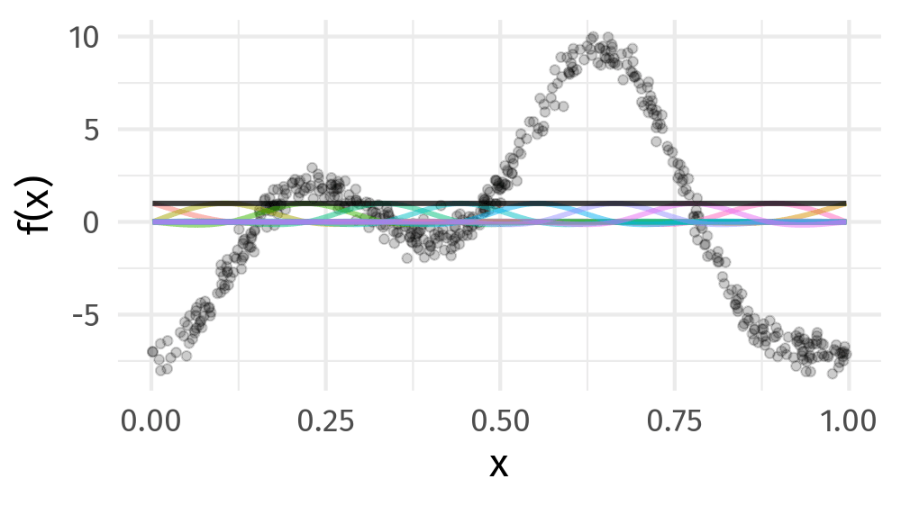

class: inverse middle center big-subsection

```{r setup, include=FALSE, cache=FALSE}
options(htmltools.dir.version = FALSE)
knitr::opts_chunk$set(cache = TRUE, dev = 'svg', echo = TRUE, message = FALSE, warning = FALSE,
                      fig.height=6, fig.width = 1.777777*6)

library('here')
library('mgcv')
library('gratia')
library('gamair')
library('ggplot2')
library('purrr')
library('mvnfast')
library("tibble")
library('gganimate')
library('cowplot')
library('tidyr')
library("knitr")
library("viridis")
library('readr')
library('dplyr')
library('gganimate')

## plot defaults
theme_set(theme_minimal(base_size = 16, base_family = 'Fira Sans'))

## constants
anim_width <- 1000
anim_height <- anim_width / 1.77777777
anim_dev <- 'png'
anim_res <- 200
```

# Welcome

???

I'm live streaming today from Treaty 4 lands. These are the territories of the nêhiyawak (nay-hi-yuh-wuk, Cree), Anihšināpēk (uh-nish-i-naa-payk, Saulteaux), Dakota, Lakota, Nakoda, and the homeland of the Métis/Michif Nation. Today, these lands continue to be the shared territory of many diverse peoples.

---

# Logistics

## Slides

Slidedeck: [bit.ly/gam-webinar](https://bit.ly/gam-webinar)
Sources: [bit.ly/gam-webinar-git](https://bit.ly/gam-webinar-git)

Direct download a ZIP of everything: [bit.ly/gam-webinar-zip](https://bit.ly/gam-webinar-zip)

Unpack the zip & remember where you put it

## Q & A

Add questions to Google Doc: [bit.ly/gam-webinar-qa](https://bit.ly/gam-webinar-qa)

## Recording

Livestream will be recorded &mdash; [youtu.be/sgw4cu8hrZM](https://youtu.be/sgw4cu8hrZM)

---

# Donation

In lieu of not charging for this webinar, if you are able to, financially, please make a donation to the University of Regina's **Student Emergency Fund**

<https://giving.uregina.ca/student-emergency-fund>

---

# Today's topics

* What are GAMs?

* How to fit GAMs in R with **mgcv**

* Model Checking

* Model Diagnostics

* Examples

---
class: inverse middle center subsection

# Motivating example

---

# HadCRUT4 time series

```{r hadcrut-temp-example, echo = FALSE}
library('readr')
library('dplyr')
URL <-  "https://bit.ly/hadcrutv4"
gtemp <- read_delim(URL, delim = ' ', col_types = 'nnnnnnnnnnnn', col_names = FALSE) %>%
    select(num_range('X', 1:2)) %>% setNames(nm = c('Year', 'Temperature'))

## Plot
gtemp_plt <- ggplot(gtemp, aes(x = Year, y = Temperature)) +
    geom_line() + 
    geom_point() +
    labs(x = 'Year', y = expression(Temeprature ~ degree*C))
gtemp_plt
```

???

Hadley Centre NH temperature record ensemble

How would you model the trend in these data?

---

# Linear Models

$$y_i \sim \mathcal{N}(\mu_i, \sigma^2)$$

$$\mu_i = \beta_0 + \beta_1 x_{1i} + \beta_2 x_{2i} + \cdots + \beta_j x_{ji}$$

Assumptions

1. linear effects of covariates are good approximation of the true effects
2. conditional on the values of covariates, $y_i | \mathbf{X} \sim \mathcal{N}(0, \sigma^2)$
3. this implies all observations have the same *variance*
4. $y_i | \mathbf{X}$ are *independent*

An **additive** model address the first of these

---
class: inverse center middle

# Why bother with anything more complex?

---

# Is this linear?

```{r hadcrut-temp-example, echo = FALSE}
```

---

# Polynomials perhaps&hellip;

```{r hadcrut-temp-polynomial, echo = FALSE}
p <- c(1,3,8,15)
N <- 300
newd <- with(gtemp, data.frame(Year = seq(min(Year), max(Year), length = N)))
polyFun <- function(i, data = data) {
    lm(Temperature ~ poly(Year, degree = i), data = data)
}
mods <- lapply(p, polyFun, data = gtemp)
pred <- vapply(mods, predict, numeric(N), newdata = newd)
colnames(pred) <- p
newd <- cbind(newd, pred)
polyDat <- gather(newd, Degree, Fitted, - Year)
polyDat <- mutate(polyDat, Degree = ordered(Degree, levels = p))
gtemp_plt + geom_line(data = polyDat, mapping = aes(x = Year, y = Fitted, colour = Degree),
                      size = 1.5, alpha = 0.9) +
    scale_color_brewer(name = "Degree", palette = "PuOr") +
    theme(legend.position = "right")
```

---

# Polynomials perhaps&hellip;

We can keep on adding ever more powers of $\boldsymbol{x}$ to the model &mdash; model selection problem

**Runge phenomenon** &mdash; oscillations at the edges of an interval &mdash; means simply moving to higher-order polynomials doesn't always improve accuracy

---

# GAMs offer a solution

---

# HadCRUT data set

```{r read-hadcrut, echo = TRUE}
library('readr')
library('dplyr')
URL <-  "https://bit.ly/hadcrutv4"
gtemp <- read_delim(URL, delim = ' ', col_types = 'nnnnnnnnnnnn', col_names = FALSE) %>%
    select(num_range('X', 1:2)) %>% setNames(nm = c('Year', 'Temperature'))
```

[File format](https://www.metoffice.gov.uk/hadobs/hadcrut4/data/current/series_format.html)

---

# HadCRUT data set

```{r show-hadcrut, echo = TRUE}
gtemp
```

---

# Fitting a GAM

```{r hadcrutemp-fitted-gam, echo = TRUE, results = 'hide'}
library('mgcv')
m <- gam(Temperature ~ s(Year), data = gtemp, method = 'REML')
summary(m)
```

.smaller[
```{r hadcrutemp-fitted-gam, echo = FALSE}
```
]

---

# Fitted GAM

```{r hadcrtemp-plot-gam, echo = FALSE}
N <- 300
newd <- as_tibble(with(gtemp, data.frame(Year = seq(min(Year), max(Year), length = N))))
pred <- as_tibble(as.data.frame(predict(m, newdata = newd, se.fit = TRUE,
                                        unconditional = TRUE)))
pred <- bind_cols(newd, pred) %>%
    mutate(upr = fit + 2 * se.fit, lwr = fit - 2*se.fit)

ggplot(gtemp, aes(x = Year, y = Temperature)) +
    geom_point() +
    geom_ribbon(data = pred,
                mapping = aes(ymin = lwr, ymax = upr, x = Year), alpha = 0.4, inherit.aes = FALSE,
                fill = "#fdb338") +
    geom_line(data = pred,
              mapping = aes(y = fit, x = Year), inherit.aes = FALSE, size = 1, colour = "#025196") +
    labs(x = 'Year', y = expression(Temeprature ~ degree*C))
```

---

# GAMs

---

# Generalized Additive Models

<br />


.references[Source: [GAMs in R by Noam Ross](https://noamross.github.io/gams-in-r-course/)]

???

GAMs are an intermediate-complexity model

* can learn from data without needing to be informed by the user
* remain interpretable because we can visualize the fitted features

---

# How is a GAM different?

In LM we model the mean of data as a sum of linear terms:

$$y_i = \beta_0 +\sum_j \color{red}{ \beta_j x_{ji}} +\epsilon_i$$

A GAM is a sum of _smooth functions_ or _smooths_

$$y_i = \beta_0 + \sum_j \color{red}{s_j(x_{ji})} + \epsilon_i$$

where $\epsilon_i \sim N(0, \sigma^2)$, $y_i \sim \text{Normal}$ (for now)

Call the above equation the **linear predictor** in both cases

---

# Fitting a GAM in R

```r
model <- gam(y ~ s(x1) + s(x2) + te(x3, x4), # formuala describing model
             data = my_data_frame,           # your data
             method = 'REML',                # or 'ML'
             family = gaussian)              # or something more exotic
```

`s()` terms are smooths of one or more variables

`te()` terms are the smooth equivalent of *main effects + interactions*

---

# How did `gam()` *know*?

```{r hadcrtemp-plot-gam, echo = FALSE}
```

---
class: inverse
background-image: url('./resources/rob-potter-398564.jpg')
background-size: contain

# What magic is this?

.footnote[
<a style="background-color:black;color:white;text-decoration:none;padding:4px 6px;font-family:-apple-system, BlinkMacSystemFont, &quot;San Francisco&quot;, &quot;Helvetica Neue&quot;, Helvetica, Ubuntu, Roboto, Noto, &quot;Segoe UI&quot;, Arial, sans-serif;font-size:12px;font-weight:bold;line-height:1.2;display:inline-block;border-radius:3px;" href="https://unsplash.com/@robpotter?utm_medium=referral&amp;utm_campaign=photographer-credit&amp;utm_content=creditBadge" target="_blank" rel="noopener noreferrer" title="Download free do whatever you want high-resolution photos from Rob Potter"><span style="display:inline-block;padding:2px 3px;"><svg xmlns="http://www.w3.org/2000/svg" style="height:12px;width:auto;position:relative;vertical-align:middle;top:-1px;fill:white;" viewBox="0 0 32 32"><title></title><path d="M20.8 18.1c0 2.7-2.2 4.8-4.8 4.8s-4.8-2.1-4.8-4.8c0-2.7 2.2-4.8 4.8-4.8 2.7.1 4.8 2.2 4.8 4.8zm11.2-7.4v14.9c0 2.3-1.9 4.3-4.3 4.3h-23.4c-2.4 0-4.3-1.9-4.3-4.3v-15c0-2.3 1.9-4.3 4.3-4.3h3.7l.8-2.3c.4-1.1 1.7-2 2.9-2h8.6c1.2 0 2.5.9 2.9 2l.8 2.4h3.7c2.4 0 4.3 1.9 4.3 4.3zm-8.6 7.5c0-4.1-3.3-7.5-7.5-7.5-4.1 0-7.5 3.4-7.5 7.5s3.3 7.5 7.5 7.5c4.2-.1 7.5-3.4 7.5-7.5z"></path></svg></span><span style="display:inline-block;padding:2px 3px;">Rob Potter</span></a>
]

---
class: inverse
background-image: url('resources/wiggly-things.png')
background-size: contain

???

---

```{r smooth-fun-animation, results = FALSE, echo = FALSE}
f <- function(x) {
    x^11 * (10 * (1 - x))^6 + ((10 * (10 * x)^3) * (1 - x)^10)
}

draw_beta <- function(n, k, mu = 1, sigma = 1) {
    rmvn(n = n, mu = rep(mu, k), sigma = diag(rep(sigma, k)))
}

weight_basis <- function(bf, x, n = 1, k, ...) {
    beta <- draw_beta(n = n, k = k, ...)
    out <- sweep(bf, 2L, beta, '*')
    colnames(out) <- paste0('f', seq_along(beta))
    out <- as_tibble(out)
    out <- add_column(out, x = x)
    out <- pivot_longer(out, -x, names_to = 'bf', values_to = 'y')
    out
}

random_bases <- function(bf, x, draws = 10, k, ...) {
    out <- rerun(draws, weight_basis(bf, x = x, k = k, ...))
    out <- bind_rows(out)
    out <- add_column(out, draw = rep(seq_len(draws), each = length(x) * k),
                      .before = 1L)
    class(out) <- c("random_bases", class(out))
    out
}

plot.random_bases <- function(x, facet = FALSE) {
    plt <- ggplot(x, aes(x = x, y = y, colour = bf)) +
        geom_line(lwd = 1, alpha = 0.75) +
        guides(colour = FALSE)
    if (facet) {
        plt + facet_wrap(~ draw)
    }
    plt
}

normalize <- function(x) {
    rx <- range(x)
    z <- (x - rx[1]) / (rx[2] - rx[1])
    z
}

set.seed(1)
N <- 500
data <- tibble(x     = runif(N),
               ytrue = f(x),
               ycent = ytrue - mean(ytrue),
               yobs  = ycent + rnorm(N, sd = 0.5))

k <- 10
knots <- with(data, list(x = seq(min(x), max(x), length = k)))
sm <- smoothCon(s(x, k = k, bs = "cr"), data = data, knots = knots)[[1]]$X
colnames(sm) <- levs <- paste0("f", seq_len(k))
basis <- pivot_longer(cbind(sm, data), -(x:yobs), names_to = 'bf')
basis

set.seed(2)
bfuns <- random_bases(sm, data$x, draws = 20, k = k)

smooth <- bfuns %>%
    group_by(draw, x) %>%
    summarise(spline = sum(y)) %>%
    ungroup()

p1 <- ggplot(smooth) +
    geom_line(data = smooth, aes(x = x, y = spline), lwd = 1.5) +
    labs(y = 'f(x)', x = 'x') +
    theme_minimal(base_size = 16, base_family = 'Fira Sans')

smooth_funs <- animate(
    p1 + transition_states(draw, transition_length = 4, state_length = 2) + 
    ease_aes('cubic-in-out'),
    nframes = 200, height = anim_height, width = anim_width, res = anim_res, dev = anim_dev)

anim_save('resources/spline-anim.gif', smooth_funs)
```

# Wiggly things

.center[]

???

GAMs use splines to represent the non-linear relationships between covariates, here `x`, and the response variable on the `y` axis.

---

# Basis expansions

In the polynomial models we used a polynomial basis expansion of $\boldsymbol{x}$

* $\boldsymbol{x}^0 = \boldsymbol{1}$ &mdash; the model constant term
* $\boldsymbol{x}^1 = \boldsymbol{x}$ &mdash; linear term
* $\boldsymbol{x}^2$
* $\boldsymbol{x}^3$
* &hellip;

---

# Splines

Splines are *functions* composed of simpler functions

Simpler functions are *basis functions* & the set of basis functions is a *basis*

When we model using splines, each basis function $b_k$ has a coefficient $\beta_k$

Resultant spline is a the sum of these weighted basis functions, evaluated at the values of $x$

$$s(x) = \sum_{k = 1}^K \beta_k b_k(x)$$

---

# Splines formed from basis functions

```{r basis-functions, fig.height=6, fig.width = 1.777777*6, echo = FALSE}
ggplot(basis,
       aes(x = x, y = value, colour = bf)) +
    geom_line(lwd = 2, alpha = 0.5) +
    guides(colour = FALSE) +
    labs(x = 'x', y = 'b(x)') +
    theme_minimal(base_size = 20, base_family = 'Fira Sans')
```

???

Splines are built up from basis functions

Here I'm showing a cubic regression spline basis with 10 knots/functions

We weight each basis function to get a spline. Here all the basisi functions have the same weight so they would fit a horizontal line

---

# Weight basis functions &#8680; spline

```{r basis-function-animation, results = 'hide', echo = FALSE}
bfun_plt <- plot(bfuns) +
    geom_line(data = smooth, aes(x = x, y = spline),
              inherit.aes = FALSE, lwd = 1.5) +
    labs(x = 'x', y = 'f(x)') +
    theme_minimal(base_size = 14, base_family = 'Fira Sans')

bfun_anim <- animate(
    bfun_plt + transition_states(draw, transition_length = 4, state_length = 2) + 
    ease_aes('cubic-in-out'),
    nframes = 200, height = anim_height, width = anim_width, res = anim_res, dev = anim_dev)

anim_save('resources/basis-fun-anim.gif', bfun_anim)
```

.center[]

???

But if we choose different weights we get more wiggly spline

Each of the splines I showed you earlier are all generated from the same basis functions but using different weights

---

# How do GAMs learn from data?

```{r example-data-figure, fig.height=6, fig.width = 1.777777*6, echo = FALSE}
data_plt <- ggplot(data, aes(x = x, y = ycent)) +
    geom_line(col = 'goldenrod', lwd = 2) +
    geom_point(aes(y = yobs), alpha = 0.2, size = 3) +
    labs(x = 'x', y = 'f(x)') +
    theme_minimal(base_size = 20, base_family = 'Fira Sans')
data_plt
```

???

How does this help us learn from data?

Here I'm showing a simulated data set, where the data are drawn from the orange functions, with noise. We want to learn the orange function from the data

---

# Maximise penalised log-likelihood &#8680; &beta;

```{r basis-functions-anim, results = "hide", echo = FALSE}
sm2 <- smoothCon(s(x, k = k, bs = "cr"), data = data, knots = knots)[[1]]$X
beta <- coef(lm(ycent ~ sm2 - 1, data = data))
wtbasis <- sweep(sm2, 2L, beta, FUN = "*")
colnames(wtbasis) <- colnames(sm2) <- paste0("F", seq_len(k))
## create stacked unweighted and weighted basis
basis <- as_tibble(rbind(sm2, wtbasis)) %>%
    add_column(x = rep(data$x, times = 2),
               type = rep(c('unweighted', 'weighted'), each = nrow(sm2)),
               .before = 1L)
##data <- cbind(data, fitted = rowSums(scbasis))
wtbasis <- as_tibble(rbind(sm2, wtbasis)) %>%
    add_column(x      = rep(data$x, times = 2),
               fitted = rowSums(.),
               type   = rep(c('unweighted', 'weighted'), each = nrow(sm2))) %>%
    pivot_longer(-(x:type), names_to = 'bf')
basis <- pivot_longer(basis, -(x:type), names_to = 'bf')

p3 <- ggplot(data, aes(x = x, y = ycent)) +
    geom_point(aes(y = yobs), alpha = 0.2) +
    geom_line(data = basis,
              mapping = aes(x = x, y = value, colour = bf),
              lwd = 1, alpha = 0.5) +
    geom_line(data = wtbasis,
              mapping = aes(x = x, y = fitted), lwd = 1, colour = 'black', alpha = 0.75) +
    guides(colour = FALSE) +
    labs(y = 'f(x)', x = 'x') +
    theme_minimal(base_size = 16, base_family = 'Fira Sans')

crs_fit <- animate(p3 + transition_states(type, transition_length = 4, state_length = 2) + 
                   ease_aes('cubic-in-out'),
                   nframes = 100, height = anim_height, width = anim_width, res = anim_res,
                   dev = anim_dev)

anim_save('./resources/gam-crs-animation.gif', crs_fit)
```

.center[]

???

Fitting a GAM involves finding the weights for the basis functions that produce a spline that fits the data best, subject to some constraints


---
class: inverse middle center subsection

# Avoid overfitting our sample

---
class: inverse center middle large-subsection

# How wiggly?

$$
\int_{\mathbb{R}} [f^{\prime\prime}]^2 dx = \boldsymbol{\beta}^{\mathsf{T}}\mathbf{S}\boldsymbol{\beta}
$$

---
class: inverse center middle large-subsection

# Penalised fit

$$
\mathcal{L}_p(\boldsymbol{\beta}) = \mathcal{L}(\boldsymbol{\beta}) - \frac{1}{2} \lambda\boldsymbol{\beta}^{\mathsf{T}}\mathbf{S}\boldsymbol{\beta}
$$

---

# Wiggliness

$$\int_{\mathbb{R}} [f^{\prime\prime}]^2 dx = \boldsymbol{\beta}^{\mathsf{T}}\mathbf{S}\boldsymbol{\beta} = \large{W}$$

(Wiggliness is 100% the right mathy word)

We penalize wiggliness to avoid overfitting

---

# Making wiggliness matter

$W$ measures **wiggliness**

(log) likelihood measures closeness to the data

We use a **smoothing parameter** $\lambda$ to define the trade-off, to find
the spline coefficients $B_k$ that maximize the **penalized** log-likelihood

$$\mathcal{L}_p = \log(\text{Likelihood})  - \lambda W$$

---

# HadCRUT4 time series

```{r hadcrut-temp-penalty, echo = FALSE}
K <- 40
lambda <- c(10000, 1, 0.01, 0.00001)
N <- 300
newd <- with(gtemp, data.frame(Year = seq(min(Year), max(Year), length = N)))
fits <- lapply(lambda, function(lambda) gam(Temperature ~ s(Year, k = K, sp = lambda), data = gtemp))
pred <- vapply(fits, predict, numeric(N), newdata = newd)
op <- options(scipen = 100)
colnames(pred) <- lambda
newd <- cbind(newd, pred)
lambdaDat <- gather(newd, Lambda, Fitted, - Year)
lambdaDat <- transform(lambdaDat, Lambda = factor(paste("lambda ==", as.character(Lambda)),
                                                  levels = paste("lambda ==", as.character(lambda))))

gtemp_plt + geom_line(data = lambdaDat, mapping = aes(x = Year, y = Fitted, group = Lambda),
                      size = 1, colour = "#e66101") +
    facet_wrap( ~ Lambda, ncol = 2, labeller = label_parsed)
options(op)
```

---

# Picking the right wiggliness

.pull-left[
Two ways to think about how to optimize $\lambda$:

* Predictive: Minimize out-of-sample error
* Bayesian:  Put priors on our basis coefficients
]

.pull-right[
Many methods: AIC, Mallow's $C_p$, GCV, ML, REML

* **Practically**, use **REML**, because of numerical stability
* Hence `gam(..., method='REML')`
]

.center[

]

---

# Maximum allowed wiggliness

We set **basis complexity** or "size" $k$

This is _maximum wigglyness_, can be thought of as number of small functions that make up a curve

Once smoothing is applied, curves have fewer **effective degrees of freedom (EDF)**

EDF < $k$

---

# Maximum allowed wiggliness

$k$ must be *large enough*, the $\lambda$ penalty does the rest

*Large enough* &mdash; space of functions representable by the basis includes the true function or a close approximation to the tru function

Bigger $k$ increases computational cost

In **mgcv**, default $k$ values are arbitrary &mdash; after choosing the model terms, this is the key user choice

**Must be checked!** &mdash; `gam.check()`


---

# GAM summary so far

1. GAMs give us a framework to model  flexible nonlinear relationships

2. Use little functions (**basis functions**) to make big functions (**smooths**)

3. Use a **penalty** to trade off wiggliness/generality 

4. Need to make sure your smooths are **wiggly enough**

---

# Portugese larks

.row[
.col-7[

```{r birds-1, echo = TRUE}
library('gamair')
data(bird)

bird <- transform(bird,
            crestlark = factor(crestlark),
            linnet = factor(linnet),
            e = x / 1000,
            n = y / 1000)
head(bird)
```
]

.col-5[

```{r birds-2, fig.width = 5, fig.height = 6, echo = FALSE}
ggplot(bird, aes(x = e, y = n, colour = crestlark)) + geom_point(size = 0.5) + coord_fixed() + scale_colour_discrete(na.value = '#bbbbbb33') + labs(x = NULL, y = NULL)
```
]
]

---
 
# Portugese larks &mdash; binomial GAM

.row[
.col-6[
```{r birds-gam-1, echo = TRUE}
crest <- gam(crestlark ~ s(e, n, k = 100),
             data = bird,
             family = binomial,
             method = 'REML')
```

$s(e, n)$ indicated by `s(e, n)` in the formula

Isotropic thin plate spline

`k` sets size of basis dimension; upper limit on EDF

Smoothness parameters estimated via REML
]

.col-6[
.smaller[
```{r birds-gam-2, echo = TRUE}
summary(crest)
```
]
]
]

---

# Portugese larks &mdash; binomial GAM

Model checking with binary data is a pain &mdash; residuals look weird

Alternatively we can aggregate data at the `QUADRICULA` level & fit a binomial count model

.smaller[
```{r munge-larks, echo = TRUE}
## convert back to numeric
bird <- transform(bird,
                  crestlark = as.numeric(as.character(crestlark)),
                  linnet = as.numeric(as.character(linnet)))
## some variables to help aggregation
bird <- transform(bird, tet.n = rep(1, nrow(bird)),
                  N = rep(1, nrow(bird)), stringsAsFactors = FALSE)
## set to NA if not surveyed
bird$N[is.na(as.vector(bird$crestlark))] <- NA
## aggregate
bird2 <- aggregate(data.matrix(bird), by = list(bird$QUADRICULA),
                   FUN = sum, na.rm = TRUE)
## scale by Quads aggregated
bird2 <- transform(bird2, e = e / tet.n, n = n / tet.n)

## fit binomial GAM
crest2 <- gam(cbind(crestlark, N - crestlark) ~ s(e, n, k = 100),
              data = bird2, family = binomial, method = 'REML')
```
]

---

# Model checking

.pull-left[
.smaller[
```{r crest-3, echo = TRUE}
crest3 <- gam(cbind(crestlark, N - crestlark) ~
                  s(e, n, k = 100),
              data = bird2, family = quasibinomial,
              method = 'REML')
```
]

Model residuals don't look too bad

Bands of points due to integers

Some overdispersion &mdash; &phi; = `r round(crest3$scale,2)`
]

.pull-right[
```{r gam-check-aggregated-lark, echo = TRUE, fig.width = 4.5, fig.height = 4}
ggplot(data.frame(Fitted = fitted(crest2),
                  Resid = resid(crest2)),
       aes(Fitted, Resid)) + geom_point() 
```
]


---
class: inverse center middle subsection

# Model checking

---

# Model checking

So you have a GAM:

- How do you know you have the right degrees of freedom? `gam.check()`

- Diagnosing model issues: `gam.check()` part 2

---

# GAMs are models too

How accurate your predictions will be depends on how good the model is

```{r misspecify, echo = FALSE}
set.seed(15)
model_list = c("right model", 
               "wrong distribution",
               "heteroskedasticity",
               "dependent data",
               "wrong functional form")
n <- 60
sigma=1
x <- seq(-1,1, length=n)
model_data <- as.data.frame(expand.grid( x=x,model=model_list))
model_data$y <- 5*model_data$x^2 + 2*model_data$x
for(i in model_list){
  if(i == "right model"){
    model_data[model_data$model==i, "y"] <- model_data[model_data$model==i, "y"]+ 
      rnorm(n,0, sigma)
  } else if(i == "wrong distribution"){
    model_data[model_data$model==i, "y"] <- model_data[model_data$model==i, "y"]+ 
      rt(n,df = 3)*sigma
  } else if(i == "heteroskedasticity"){
    model_data[model_data$model==i, "y"] <- model_data[model_data$model==i, "y"]+  
      rnorm(n,0, sigma*10^(model_data[model_data$model==i, "x"]))
  } else if(i == "dependent data"){
    model_data[model_data$model==i, "y"] <- model_data[model_data$model==i, "y"]+ 
      arima.sim(model = list(ar=c(.7)), n = n,sd=sigma) 
  } else if(i=="wrong functional form") {
    model_data[model_data$model==i, "y"] <- model_data[model_data$model==i, "y"]+ 
      rnorm(n,0, sigma) + ifelse(model_data[model_data$model==i, "x"]>0, 5,-5)
  }
}
ggplot(aes(x,y), data= model_data)+
  geom_point()+
  geom_line(color=ifelse(model_data$model=="dependent data", "black",NA))+
  facet_wrap(~model)+
  geom_smooth(method=gam, formula = y~s(x,k=12),method.args = list(method="REML"))+
  theme(strip.text = element_text(size=16))
```

---
class: inverse center middle

# How do we test how well our model fits?

---

# Simulated data

```{r sims, include=TRUE,echo=TRUE}
set.seed(2)
n <- 400
x1 <- rnorm(n)
x2 <- rnorm(n)
y_val <- 1 + 2*cos(pi*x1) + 2/(1+exp(-5*(x2)))
y_norm <- y_val + rnorm(n, 0, 0.5)
y_negbinom <- rnbinom(n, mu = exp(y_val),size=10)
y_binom <- rbinom(n,1,prob = exp(y_val)/(1+exp(y_val)))
```

---

# Simulated data

```{r sims_plot,fig.width = 11, fig.height = 5.5, echo = FALSE}
p1 <- ggplot(data.frame(x = x1, y = y_norm),
             aes(x = x, y = y)) +
    geom_point()

p2 <- ggplot(data.frame(x = x2, y = y_norm),
             aes(x = x, y = y)) +
    geom_point()

p3 <- ggplot(data.frame(x = x1, y = y_negbinom),
             aes(x = x, y = y)) +
    geom_point()

p4 <- ggplot(data.frame(x = x2, y = y_negbinom),
             aes(x = x, y = y)) +
    geom_point()

p5 <- ggplot(data.frame(x = x1, y = y_binom),
             aes(x = x, y = y)) +
    geom_point()

p6 <- ggplot(data.frame(x = x2, y = y_binom),
             aes(x = x, y = y)) +
    geom_point()

plot_grid(p1, p3, p5, p2, p4, p6, ncol = 3, align = 'hv', axis = 'lrtb')
```

---
class: inverse middle center

# gam.check() part 1: do you have the right functional form?

---

# How well does the model fit?

- Many choices: k, family, type of smoother, &hellip;

- How do we assess how well our model fits?

---

# Basis size *k*

- Set `k` per term

- e.g. `s(x, k=10)` or `s(x, y, k=100)`

- Penalty removes "extra" wigglyness
    
	- *up to a point!*

- (But computation is slower with bigger `k`)

---

# Checking basis size

```{r gam_check_norm1, fig.keep="none", include=TRUE,echo=TRUE, fig.width=11, fig.height = 5.5, fig.align="center"}
norm_model_1 <- gam(y_norm~s(x1, k = 4) + s(x2, k = 4), method = 'REML')
gam.check(norm_model_1)
```

---

# Checking basis size

```{r gam_check_norm2, fig.keep="none", include=TRUE, echo=TRUE, fig.width=15, fig.height = 5.5,fig.align="center"}
norm_model_2 <- gam(y_norm ~ s(x1, k = 12) + s(x2, k = 4), method = 'REML')
gam.check(norm_model_2)
```

---

# Checking basis size

```{r gam_check_norm3, fig.keep="none", include=TRUE, echo=TRUE}
norm_model_3 <- gam(y_norm ~ s(x1, k = 12) + s(x2, k = 12),method = 'REML')
gam.check(norm_model_3)
```

---

# Checking basis size

```{r gam_check_norm4, echo = FALSE}
p1 <- draw(norm_model_1)
p2 <- draw(norm_model_2)
p3 <- draw(norm_model_3)

plot_grid(p1, p2, p3, nrow = 3, align = 'hv', axis = 'lrtb')
```

---
class: inverse middle center subsection

# Model diagnostics

---
class: inverse middle center

# Using gam.check() part 2: visual checks

---

# gam.check() plots

`gam.check()` creates 4 plots: 

1. Quantile-quantile plots of residuals. If the model is right, should follow 1-1 line

2. Histogram of residuals

3. Residuals vs. linear predictor

4. Observed vs. fitted values

`gam.check()` uses deviance residuals by default

---

# Gaussian data, Gaussian model

```{r gam_check_plots1, include=TRUE, echo=TRUE, results="hide"}
norm_model <- gam(y_norm ~ s(x1, k=12) + s(x2, k=12), method = 'REML')
gam.check(norm_model, rep = 500)
```

---

# Negative binomial data, Poisson model

```{r gam_check_plots2, include=T, echo=TRUE, results="hide"}
pois_model <- gam(y_negbinom ~ s(x1, k=12) + s(x2, k=12), family=poisson, method= 'REML')
gam.check(pois_model, rep = 500)
```

---

# NB data, NB model

```{r gam_check_plots3, include=T,echo=TRUE, results="hide"}
negbin_model <- gam(y_negbinom ~ s(x1, k=12) + s(x2, k=12), family = nb, method = 'REML')
gam.check(negbin_model, rep = 500)
```

---

# NB data, NB model

```{r appraise-gam-check-example}
appraise(negbin_model)
```

---
class: inverse center middle

# Model selection

---

# Model selection

Model (or variable) selection &mdash; an important area of theoretical and applied interest

- In statistics we aim for a balance between *fit* and *parsimony*

- In applied research we seek the set of covariates with strongest effects on $y$

We seek a subset of covariates that improves *interpretability* and *prediction accuracy*

---
class: inverse center middle

# Shrinkage & additional penalties

---

# Shrinkage & additional penalties

Smoothing parameter estimation allows selection of a wide range of potentially complex functions for smooths...

But, cannot remove a term entirely from the model because the penalties used act only on the *range space* of a spline basis. The *null space* of the basis is unpenalised.

- **Null space** &mdash; the basis functions that are smooth (constant, linear)

- **Range space** &mdash; the basis functions that are wiggly

---

# Shrinkage & additional penalties

**mgcv** has two ways to penalize the null space, i.e. to do selection

- *double penalty approach* via `select = TRUE`

- *shrinkage approach* via special bases for
    
	- thin plate spline (default, `s(..., bs = 'ts')`),
    
	- cubic splines  (`s(..., bs = 'cs')`)

**double penalty** tends to works best, but applies to all smooths *and* doubles the number of smoothness parameters to estimate

Other shrinkage/selection approaches *are available* in other software

---

# Empirical Bayes...?

$\mathbf{S}_j$ can be viewed as prior precision matrices and $\lambda_j$ as improper Gaussian priors on the spline coefficients.

The impropriety derives from $\mathbf{S}_j$ not being of full rank (zeroes in $\mathbf{\Lambda}_j$).

Both the double penalty and shrinkage smooths remove the impropriety from the Gaussian prior

---
# Empirical Bayes...?

- **Double penalty** &mdash; makes no assumption as to how much to shrink the null space. This is determined from the data via estimation of $\lambda_j^{*}$

- **Shrinkage smooths** &mdash; assumes null space should be shrunk less than the wiggly part

Marra & Wood (2011) show that the double penalty and the shrinkage smooth approaches

- performed significantly better than alternatives in terms of *predictive ability*, and

- performed as well as alternatives in terms of variable selection

---

# Example

- Simulate Poisson counts
- 4 known functions (left)
- 2 spurious covariates (`runif()` & not shown)

```{r setup-shrinkage-example}
## an example of automatic model selection via null space penalization
set.seed(3)
n <- 200
dat <- gamSim(1, n=n, scale=.15, dist='poisson', verbose = FALSE) ## simulate data
dat <- transform(dat, x4 = runif(n, 0, 1), x5 = runif(n, 0, 1),
                 f4 = rep(0, n), f5 = rep(0, n))   ## spurious
```
```{r shrinkage-example-model-fit, echo = TRUE}
b <- gam(y ~ s(x0) + s(x1) + s(x2) + s(x3) +
             s(x4) + s(x5),
         data = dat, family = poisson, method = 'REML',
         select = TRUE)
```

---

# Example

```{r shrinkage-example-truth, echo = FALSE}
p1 <- ggplot(dat, aes(x = x0, y = f0)) + geom_line()
p2 <- ggplot(dat, aes(x = x1, y = f1)) + geom_line()
p3 <- ggplot(dat, aes(x = x2, y = f2)) + geom_line()
p4 <- ggplot(dat, aes(x = x3, y = f3)) + geom_line()
p5 <- ggplot(dat, aes(x = x4, y = f4)) + geom_line()
p6 <- ggplot(dat, aes(x = x5, y = f5)) + geom_line()
plot_grid(p1, p2, p3, p4, p5, p6, ncol = 3, align = 'vh', labels = paste0('x', 1:6))
```

---

# Example

.smaller[
```{r shrinkage-example-summary}
summary(b)
```
]

---

# Example

```{r shrinkage-example-plot}
library('gratia'); draw(b, scales = 'fixed')
```

---
class: inverse center middle

# Confidence intervals for smooths

---

# Confidence intervals for smooths

`plot.gam()` produces approximate 95% intervals (at +/- 2 SEs)

What do these intervals represent?

Nychka (1988) showed that standard Wahba/Silverman type Bayesian confidence intervals on smooths had good **across-the-function** frequentist coverage properties

When *averaged* over the range of covariate, 1 - &alpha; coverage is approximately 1 - &alpha;

---

# Confidence intervals for smooths

Marra & Wood (2012) extended this theory to the generalised case and explain where the coverage properties failed:

*Mustn't over-smooth too much, which happens when $\lambda_j$ are over-estimated*

Two situations where this might occur

1. where true effect is almost in the penalty null space, $\hat{\lambda}_j \rightarrow \infty$
	- ie. close to a linear function
2. where $\hat{\lambda}_j$ difficult to estimate due to highly correlated covariates
	- if 2 correlated covariates have different amounts of wiggliness, estimated effects can have degree of smoothness *reversed*

---

# Don't over-smooth

> In summary, we have shown that Bayesian componentwise variable width intervals... for the smooth components of an additive model **should achieve close to nominal *across-the-function* coverage probability**&hellip

Basically

1. Don't over smooth, and

2. Effect of uncertainty due to estimating smoothness parameter is small

---

# Confidence intervals for smooths

Marra & Wood (2012) suggested a solution to situation 1., namely true functions close to the penalty null space.

Smooths are normally subject to *identifiability* constraints (centred), which leads to zero variance where the estimated function crosses the zero line.

Instead, compute intervals for $j$ th smooth as if it alone had the intercept; identifiability constraints go on the other smooth terms.

Use

* `seWithMean = TRUE` in call to `plot.gam()`
* `overall_uncertainty = TRUE` in call to `gratia::draw()`

---

# Example

```{r setup-confint-example, fig = TRUE, fig.width = 11, fig.height = 5.5, results = "hide", echo = FALSE}
library(mgcv)
set.seed(0)
## fake some data...
f1 <- function(x) {exp(2 * x)}
f2 <- function(x) { 
  0.2*x^11*(10*(1-x))^6+10*(10*x)^3*(1-x)^10 
}
f3 <- function(x) {x*0}

n<-200
sig2 <- 12
x0 <- rep(1:4,50)
x1 <- runif(n, 0, 1)
x2 <- runif(n, 0, 1)
x3 <- runif(n, 0, 1)
e <- rnorm(n, 0, sqrt(sig2))
y <- 2*x0 + f1(x1) + f2(x2) + f3(x3) + e
x0 <- factor(x0)

## fit and plot...
b <- gam(y ~ x0 + s(x1) + s(x2) + s(x3))

op <- par(mar = c(4,4,1,1) + 0.1)
layout(matrix(1:9, ncol = 3, byrow = TRUE))
curve(f1)
curve(f2)
curve(f3)
plot(b, shade=TRUE)
plot(b, shade = TRUE, seWithMean = TRUE) ## better coverage intervals
layout(1)
par(op)
```

---
class: inverse center middle

# *p* values for smooths

---

# *p* values for smooths

*p* values for smooths are approximate:

1. they don't account for the estimation of $\lambda_j$ &mdash; treated as known, hence *p* values are biased low

2. rely on asymptotic behaviour &mdash; they tend towards being right as sample size tends to $\infty$

---

# *p* values for smooths

...are a test of **zero-effect** of a smooth term

Default *p* values rely on theory of Nychka (1988) and Marra & Wood (2012) for confidence interval coverage

If the Bayesian CI have good across-the-function properties, Wood (2013a) showed that the *p* values have

- almost the correct null distribution

- reasonable power

Test statistic is a form of $\chi^2$ statistic, but with complicated degrees of freedom

---

# *p* values for unpenalized smooths

The results of Nychka (1988) and Marra & Wood (2012) break down if smooth terms are unpenalized

This include i.i.d. Gaussian random effects, (e.g. `bs = "re"`)

Wood (2013b) proposed instead a test based on a likelihood ratio statistic:

- the reference distribution used is appropriate for testing a $\mathrm{H}_0$ on the boundary of the allowed parameter space...

- ...in other words, it corrects for a $\mathrm{H}_0$ that a variance term is zero

---

# *p* values for smooths

Have the best behaviour when smoothness selection is done using **ML**, then **REML**.

Neither of these are the default, so remember to use `method = "ML"` or `method = "REML"` as appropriate

---

# AIC for GAMs

- Comparison of GAMs by a form of AIC is an alternative frequentist approach to model selection

- Rather than using the marginal likelihood, the likelihood of the $\mathbf{\beta}_j$ *conditional* upon $\lambda_j$ is used, with the EDF replacing $k$, the number of model parameters

- This *conditional* AIC tends to select complex models, especially those with random effects, as the EDF ignores that $\lambda_j$ are estimated

- Wood et al (2016) suggests a correction that accounts for uncertainty in $\lambda_j$

$$AIC = -2\mathcal{L}(\hat{\beta}) + 2\mathrm{tr}(\widehat{\mathcal{I}}V^{'}_{\beta})$$

---

# AIC

In this example, $x_3$, $x_4$, and $x_5$ have no effects on $y$

```{r aic-example, echo = TRUE}
AIC(b1, b2)
```

When there is *no difference* in compared models, accepts larger model ~16% of the time: consistent with probability AIC chooses a model with 1 extra spurious parameter $Pr(\chi^2_1 > 2)$

```{r aic-chisq, echo = TRUE}
pchisq(2, 1, lower.tail = FALSE)
```

---
class: inverse middle center subsection

# Example

---

# Atmospheric CO<sub>2</sub>

```{r co2-example-1, echo = TRUE}
data(co2s)
head(co2s)
```

---

# Atmospheric CO<sub>2</sub>

```{r co2-example-2, echo = TRUE}
ggplot(co2s, aes(x = c.month, y = co2)) + geom_line()
```

---

# Atmospheric CO<sub>2</sub> &mdash; fit naive GAM

.smaller[
```{r co2-example-3, echo = TRUE}
b <- gam(co2 ~ s(c.month, k=300, bs="cr"), data = co2s, method = 'REML')
summary(b)
```
]

---

# Atmospheric CO<sub>2</sub> &mdash; predict

Predict the next 36 months

```{r co2-example-4, echo = TRUE}
pd <- with(co2s, data.frame(c.month = 1:(nrow(co2s)+36)))
pd <- cbind(pd, predict(b, pd, se = TRUE))
pd <- transform(pd, upr = fit + (2*se.fit), lwr = fit - (2 * se.fit))
```

---

# Atmospheric CO<sub>2</sub> &mdash; predict

```{r co2-example-5, echo = TRUE, fig.height = 5}
ggplot(pd, aes(x = c.month, y = fit)) +
    geom_ribbon(aes(ymin = lwr, ymax = upr), alpha = 0.2) +
    geom_line(data = co2s, aes(c.month, co2), col = 'red') +
    geom_line(alpha = 0.5)
```

---

# Atmospheric CO<sub>2</sub> &mdash; better model

Decompose into

1. a seasonal smooth
2. a long term trend

```{r co2-example-6, echo = TRUE}
b2 <- gam(co2 ~ s(month, bs = "cc") + s(c.month, bs = "cr", k = 300),
          data = co2s, method = 'REML',
          knots = list(month = c(0.5, 12.5)))
```

---

# Atmospheric CO<sub>2</sub> &mdash; better model

.smaller[
```{r co2-example-7, echo = TRUE}
summary(b2)
```
]

---

# Atmospheric CO<sub>2</sub> &mdash; predict

```{r co2-example-8, echo = TRUE}
nr <- nrow(co2s)
pd2 <- with(co2s, data.frame(c.month = 1:(nr+36),
                             month = rep(1:12, length.out=nr+36)))
pd2 <- cbind(pd2, predict(b2, pd2, se = TRUE))
pd2 <- transform(pd2, upr = fit + (2*se.fit), lwr = fit - (2 * se.fit))
```

---

# Atmospheric CO<sub>2</sub> &mdash; predict

```{r co2-example-9, echo = TRUE, fig.height = 5}
ggplot(pd2, aes(x = c.month, y = fit)) +
    geom_ribbon(aes(ymin = lwr, ymax = upr), alpha = 0.2) +
    geom_line(data = co2s, aes(c.month, co2), col = 'red') +
    geom_line(alpha = 0.5)
```

---

# Example

---

# Galveston Bay

.row[

.col-6[
Cross Validated question

> I have a dataset of water temperature measurements taken from a large waterbody at irregular intervals over a period of decades. (Galveston Bay, TX if you’re interested)

<https://stats.stackexchange.com/q/244042/1390>

]

.col-6[

.center[
```{r cross-validated, echo = FALSE}
knitr::include_graphics(here('resources', 'cross-validated.png'))
```
]

]
]

---

# Galveston Bay

```{r load-galveston}
galveston <- read_csv(here('data', 'gbtemp.csv')) %>%
    mutate(datetime = as.POSIXct(paste(DATE, TIME), format = '%m/%d/%y %H:%M', tz = "CDT"),
           STATION_ID = factor(STATION_ID), DoY = as.numeric(format(datetime, format = '%j')),
           ToD = as.numeric(format(datetime, format = '%H')) +
               (as.numeric(format(datetime, format = '%M')) / 60))
galveston
```

---

# Galveston Bay model description

$$
\begin{align}
  \begin{split}
      \mathrm{E}(y_i) & = \alpha + f_1(\text{ToD}_i) + f_2(\text{DoY}_i) + f_3(\text{Year}_i) + f_4(\text{x}_i, \text{y}_i) + \\
        & \quad f_5(\text{DoY}_i, \text{Year}_i) + f_6(\text{x}_i, \text{y}_i, \text{ToD}_i) + \\
        & \quad f_7(\text{x}_i, \text{y}_i, \text{DoY}_i) + f_8(\text{x}_i, \text{y}_i, \text{Year}_i)
  \end{split}
\end{align}
$$

* $\alpha$ is the model intercept,
* $f_1(\text{ToD}_i)$ is a smooth function of time of day,
* $f_2(\text{DoY}_i)$ is a smooth function of day of year ,
* $f_3(\text{Year}_i)$ is a smooth function of year,
* $f_4(\text{x}_i, \text{y}_i)$ is a 2D smooth of longitude and latitude,

---

# Galveston Bay model description

$$
\begin{align}
  \begin{split}
      \mathrm{E}(y_i) & = \alpha + f_1(\text{ToD}_i) + f_2(\text{DoY}_i) + f_3(\text{Year}_i) + f_4(\text{x}_i, \text{y}_i) + \\
        & \quad f_5(\text{DoY}_i, \text{Year}_i) + f_6(\text{x}_i, \text{y}_i, \text{ToD}_i) + \\
        & \quad f_7(\text{x}_i, \text{y}_i, \text{DoY}_i) + f_8(\text{x}_i, \text{y}_i, \text{Year}_i)
  \end{split}
\end{align}
$$

* $f_5(\text{DoY}_i, \text{Year}_i)$ is a tensor product smooth of day of year and year,
* $f_6(\text{x}_i, \text{y}_i, \text{ToD}_i)$ tensor product smooth of location & time of day
* $f_7(\text{x}_i, \text{y}_i, \text{DoY}_i)$ tensor product smooth of location day of year& 
* $f_8(\text{x}_i, \text{y}_i, \text{Year}_i$ tensor product smooth of location & year

---

# Galveston Bay model description

$$
\begin{align}
  \begin{split}
      \mathrm{E}(y_i) & = \alpha + f_1(\text{ToD}_i) + f_2(\text{DoY}_i) + f_3(\text{Year}_i) + f_4(\text{x}_i, \text{y}_i) + \\
        & \quad f_5(\text{DoY}_i, \text{Year}_i) + f_6(\text{x}_i, \text{y}_i, \text{ToD}_i) + \\
        & \quad f_7(\text{x}_i, \text{y}_i, \text{DoY}_i) + f_8(\text{x}_i, \text{y}_i, \text{Year}_i)
  \end{split}
\end{align}
$$

Effectively, the first four smooths are the main effects of

1. time of day,
2. season,
3. long-term trend,
4. spatial variation

---

# Galveston Bay model description

$$
\begin{align}
  \begin{split}
      \mathrm{E}(y_i) & = \alpha + f_1(\text{ToD}_i) + f_2(\text{DoY}_i) + f_3(\text{Year}_i) + f_4(\text{x}_i, \text{y}_i) + \\
        & \quad f_5(\text{DoY}_i, \text{Year}_i) + f_6(\text{x}_i, \text{y}_i, \text{ToD}_i) + \\
        & \quad f_7(\text{x}_i, \text{y}_i, \text{DoY}_i) + f_8(\text{x}_i, \text{y}_i, \text{Year}_i)
  \end{split}
\end{align}
$$

whilst the remaining tensor product smooths model smooth interactions between the stated covariates, which model

5. how the seasonal pattern of temperature varies over time,
6. how the time of day effect varies spatially,
7. how the seasonal effect varies spatially, and
8. how the long-term trend varies spatially

---

# Galveston Bay &mdash; full model

```{r galveston-full-model}
knots <- list(DoY = c(0.5, 366.5))
m <- bam(MEASUREMENT ~
             s(ToD, k = 10) +
             s(DoY, k = 12, bs = 'cc') +
             s(YEAR, k = 30) +
             s(LONGITUDE, LATITUDE, k = 100, bs = 'ds', m = c(1, 0.5)) +
             ti(DoY, YEAR, bs = c('cc', 'tp'), k = c(12, 15)) +
             ti(LONGITUDE, LATITUDE, ToD, d = c(2,1), bs = c('ds','tp'),
                m = list(c(1, 0.5), NA), k = c(20, 10)) +
             ti(LONGITUDE, LATITUDE, DoY, d = c(2,1), bs = c('ds','cc'),
                m = list(c(1, 0.5), NA), k = c(25, 12)) +
             ti(LONGITUDE, LATITUDE, YEAR, d = c(2,1), bs = c('ds','tp'),
                m = list(c(1, 0.5), NA), k = c(25, 15)),
         data = galveston, method = 'fREML', knots = knots,
         nthreads = c(4, 1), discrete = TRUE)
```

---

# Galveston Bay &mdash; simpler model

```{r galveston-simple-model}
m.sub <- bam(MEASUREMENT ~
             s(ToD, k = 10) +
             s(DoY, k = 12, bs = 'cc') +
             s(YEAR, k = 30) +
             s(LONGITUDE, LATITUDE, k = 100, bs = 'ds', m = c(1, 0.5)) +
             ti(DoY, YEAR, bs = c('cc', 'tp'), k = c(12, 15)),
         data = galveston, method = 'fREML', knots = knots,
         nthreads = c(4, 1), discrete = TRUE)
```

---

# Galveston Bay &mdash; simpler model?

```{r galveston-compare-models-aic}
AIC(m, m.sub)
```
---

# Galveston Bay &mdash; simpler model?

.smaller[
```{r galveston-compare-models-anova}
anova(m, m.sub, test = 'F')
```
]

---

# Galveston Bay &mdash; full model summary

.small[
```{r galveston-full-model-summary}
summary(m)
```
]

---

# Galveston Bay &mdash; full model plot

```{r galveston-full-model-plot, fig.height = 5.5}
plot(m, pages = 1, scheme = 2, shade = TRUE)
```

---

# Galveston Bay &mdash; full model plot

```{r galveston-full-model-draw}
draw(m, scales = 'free')
```

---

# Galveston Bay &mdash; predict

```{r galveston-full-predict}
pdata <- with(galveston,
              expand.grid(ToD = 12,
                          DoY = 180,
                          YEAR = seq(min(YEAR), max(YEAR), by = 1),
                          LONGITUDE = seq(min(LONGITUDE), max(LONGITUDE), length = 100),
                          LATITUDE  = seq(min(LATITUDE), max(LATITUDE), length = 100)))
fit <- predict(m, pdata)
ind <- exclude.too.far(pdata$LONGITUDE, pdata$LATITUDE,
                       galveston$LONGITUDE, galveston$LATITUDE, dist = 0.1)
fit[ind] <- NA
pred <- cbind(pdata, Fitted = fit)
```

---

# Galveston Bay &mdash; plot

```{r galveston-full-predict-plot, fig.show = 'hide'}
plt <- ggplot(pred, aes(x = LONGITUDE, y = LATITUDE)) +
    geom_raster(aes(fill = Fitted)) + facet_wrap(~ YEAR, ncol = 12) +
    scale_fill_viridis(name = expression(degree*C), option = 'plasma', na.value = 'transparent') +
    coord_quickmap() +
    theme(legend.position = 'right')
plt
```

---

# Galveston Bay &mdash; plot

```{r galveston-full-predict-plot, echo = FALSE}
```

---

# Galveston Bay &mdash;

```{r galveston-animation, echo = FALSE, results = 'hide'}
p <- ggplot(pred, aes(x = LONGITUDE, y = LATITUDE, frame = YEAR)) +
    geom_raster(aes(fill = Fitted)) +
    scale_fill_viridis(name = expression(degree*C), option = 'plasma', na.value = 'transparent') +
    coord_quickmap() +
    theme(legend.position = 'right')+
    labs(x = 'Longitude', y = 'Latitude')

anim <- p + transition_time(YEAR) +
    ggtitle('Year {round(frame_time, 0)}')

anim <- animate(anim,
                nframes = 200, height = anim_height, width = anim_width, res = 100,
                dev = anim_dev)

anim_save('./resources/galveston-animation.gif', anim)
```

.center[]

---

# Galveston Bay &mdash; plot trends

```{r galveston-trends-by-month, fig.show = 'hide'}
pdata <- with(galveston,
              expand.grid(ToD = 12,
                          DoY = c(1, 90, 180, 270),
                          YEAR = seq(min(YEAR), max(YEAR), length = 500),
                          LONGITUDE = -94.8751,
                          LATITUDE  = 29.50866))

fit <- data.frame(predict(m, newdata = pdata, se.fit = TRUE))
fit <- transform(fit, upper = fit + (2 * se.fit), lower = fit - (2 * se.fit))
pred <- cbind(pdata, fit)

plt2 <- ggplot(pred, aes(x = YEAR, y = fit, group = factor(DoY))) +
    geom_ribbon(aes(ymin = lower, ymax = upper), fill = 'grey', alpha = 0.5) +
    geom_line() + facet_wrap(~ DoY, scales = 'free_y') +
    labs(x = NULL, y = expression(Temperature ~ (degree * C)))
plt2
```

---

# Galveston Bay &mdash; plot trends

```{r galveston-trends-by-month, echo = FALSE}
```

---

# Next steps

Read Simon Wood's book!

Lots more material on our ESA GAM Workshop site

[https://noamross.github.io/mgcv-esa-workshop/]()

Noam Ross' free GAM Course

<https://noamross.github.io/gams-in-r-course/>

A couple of papers:

.smaller[
1. Simpson, G.L., 2018. Modelling Palaeoecological Time Series Using Generalised Additive Models. Frontiers in Ecology and Evolution 6, 149. https://doi.org/10.3389/fevo.2018.00149
2. Pedersen, E.J., Miller, D.L., Simpson, G.L., Ross, N., 2019. Hierarchical generalized additive models in ecology: an introduction with mgcv. PeerJ 7, e6876. https://doi.org/10.7717/peerj.6876
]

Also see my blog: [www.fromthebottomoftheheap.net](http://www.fromthebottomoftheheap.net)

---

# Acknowledgments

.row[

.col-6[

### Funding

.center[]
]

.col-6[

### Fellow GAM colleagues

David Miller

Eric Pedersen

Noam Ross

]

]

### Slides

* HTML Slide deck [bit.ly/gam-webinar](https://bit.ly/gam-webinar) &copy; Simpson (2020) [](http://creativecommons.org/licenses/by/4.0/)
* RMarkdown [Source](https://bit.ly/gam-webinar-git)

---

# References

- [Marra & Wood (2011) *Computational Statistics and Data Analysis* **55** 2372&ndash;2387.](http://doi.org/10.1016/j.csda.2011.02.004)
- [Marra & Wood (2012) *Scandinavian Journal of Statistics, Theory and Applications* **39**(1), 53&ndash;74.](http://doi.org/10.1111/j.1467-9469.2011.00760.x.)
- [Nychka (1988) *Journal of the American Statistical Association* **83**(404) 1134&ndash;1143.](http://doi.org/10.1080/01621459.1988.10478711)
- Wood (2017) *Generalized Additive Models: An Introduction with R*. Chapman and Hall/CRC. (2nd Edition)
- [Wood (2013a) *Biometrika* **100**(1) 221&ndash;228.](http://doi.org/10.1093/biomet/ass048)
- [Wood (2013b) *Biometrika* **100**(4) 1005&ndash;1010.](http://doi.org/10.1093/biomet/ast038)
- [Wood et al (2016) *JASA* **111** 1548&ndash;1563](https://doi.org/10.1080/01621459.2016.1180986)
